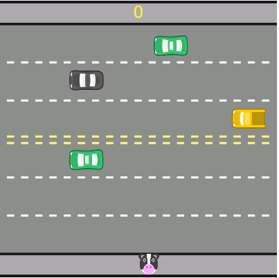

👍🏽✔🟢concluído
<!--👉🏽🛠⚠ em contrução
✋🏽❌⛔parado
👍🏽✔🟢concluído-->
# PROJETO ATARI

Neste projeto aprendo a fazer um Atari usando JavaScript.

## 🚀 Começando

Acesse a branch código comentado lá encontrará explicações e detalhes sobre a realização do código

## 📸 Imagens/Videos dos Projetos

## 🖇️ Colaborando

Sinta-se a vontade em colaborar com meu projeto.

## 📌 Versão

Versão 1.0;

## 🎁 Expressões de gratidão

* Obrigada @Alura @GuilhermeLima  @Desenvolve 📢🤓.

---
🤝🏽inspirado no readme do @lohhans
